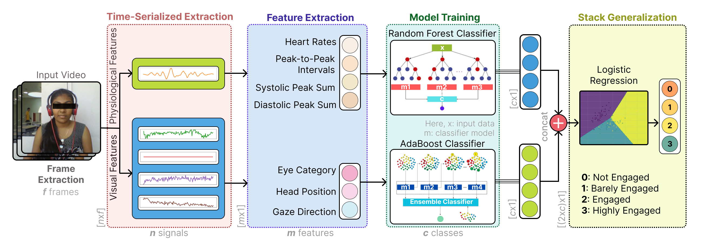

# VisioPhysioENet: Multimodal Engagement Detection

Implementation for the paper submitted to ICASSP 2025   
**[VisioPhysioENet: A Multimodal System for Detecting Learner Engagement through Visual and rPPG Signals]**  
[Alakhsimar Singh*](https://github.com/AlakhsimarSingh), [Nischay Verma*](https://github.com/nischayverma0940), [Kanav Goyal*](https://github.com/kanavgoyal898), [Amritpal Singh](), [Puneet Kumar](https://puneetkumar.com), Xiaobai Li. 

This repository contains the code and resources for **VisioPhysioENet**, a novel multimodal system for detecting learner engagement using visual and physiological signals. This project combines features extracted from video data, such as facial landmarks and eye metrics, with physiological signals derived from remote photoplethysmography (rPPG) to detect various levels of engagement in learners.



## Table of Contents

- [Introduction](#introduction)
- [Features](#features)
- [Dataset](#dataset)
- [Installation](#installation)
- [Usage](#usage)
- [Results](#results)

## Introduction

**VisioPhysioENet** uses a multimodal fusion approach to detect engagement by combining visual and physiological data. It extracts visual features using facial landmarks and head pose estimation from the Dlib and OpenCV libraries, and physiological signals like heart rate using rPPG. These data streams are processed using machine learning models to classify engagement levels into different categories.

The system was rigorously tested on the DAiSEE dataset and achieved an accuracy of **63.09%**, outperforming state-of-the-art methods in learner engagement detection.

## Features

- **Multimodal Approach**: Combines both visual and physiological signals for more accurate engagement detection.
- **Lightweight Architecture**: Designed for fast processing with minimal computational load.
- **Advanced Feature Extraction**: Uses Dlib and OpenCV for extracting visual features such as Eye Aspect Ratio (EAR), gaze direction, and head position.
- **rPPG-Based Physiological Feature Extraction**: Remote photoplethysmography is used to non-invasively monitor heart rate and other physiological signals.
- **Multimodal Fusion**: Implements both early and late fusion strategies for integrating visual and physiological data.

## Dataset

The model is trained and validated using the **DAiSEE dataset**, which includes videos of individuals annotated with engagement levels (not engaged, barely engaged, engaged, and highly engaged).

### Download the Dataset

You can download the DAiSEE dataset from its official website [here](https://people.iith.ac.in/vineethnb/resources/daisee/index.html).

## Installation

1. Clone the repository:
    ```bash
    git clone https://github.com/MIntelligence-Group/VisioPhysioENet.git
    cd VisioPhysioENet
    ```

2. Install the required Python libraries:
    ```bash
    pip install -r requirements.txt
    ```

## Usage

To use the code in this repository, follow these steps to perform feature extraction and apply the machine learning models:

### 1. Feature Extraction

1. Open the `extraction_DAiSEE_.ipynb` notebook.
2. Run all cells by selecting **Kernel** -> **Restart & Run All**.
   - This will extract features from the dataset and generate `.csv` files containing the processed data. These `.csv` files will be used as input for the machine learning models in the next steps.

### 2. Applying Machine Learning Models

After extracting the features, the next step is to apply the machine learning models for engagement detection:

1. Open the `fusion_early.ipynb` notebook.
   - This notebook implements early fusion techniques using the extracted features. Run all cells to train and evaluate the model.
   
2. Open the `fusion_late.ipynb` notebook.
   - This notebook implements late fusion techniques. Again, run all cells to train and evaluate the model using the extracted features.

By following these steps, you'll be able to extract features and apply the machine learning models for engagement detection.

## Results

The proposed **VisioPhysioENet** system was evaluated on the DAiSEE dataset, achieving an accuracy of **63.09%**. The following are some of the key metrics:

| Model                        | Modality        | Accuracy |
|------------------------------|-----------------|----------|
| InceptionNet (Frame Level)    | V          | 47.10%   |
| ResNet + Temporal Conv Net    | V         | 53.70%   |
| 3D CNN + TCN                 | V          | 59.97%   |
| **Proposed VisioPhysioENet**  | V + P   | **63.09%** |

